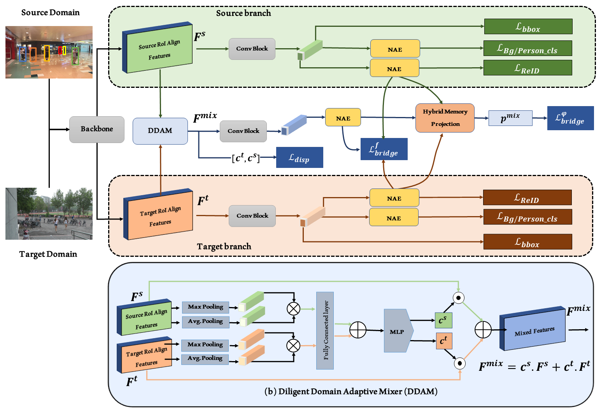

# DDAM-PS: Diligent Domain Adaptive Mixer for Person Search --  WACV2024

This is the official implementation for our **DDAM-PS: Diligent Domain Adaptive Mixer for Person Search** accepted in WACV2024. 

## Highlights
-----------------
- **Domain Adaptive Mixing Mechanism:** Our approach introduces a diligent domain adaptive mixing mechanism with the aim of narrowing the gap between the source and target domains within the context of person search domain adaptation. Specifically, we train mixed domain representations that effectively bridge the differences between these two domains, expediting the transfer of source information to the target domain. This, in turn, enhances the performance of unsupervised domain adaptation (UDA) in person search tasks.
- **Bridge and Disparity Losses:** To boost our domain adaptation capabilities and create refined mixed domain representations, we introduce two bridge losses along with a disparity loss.
- **Decoupling of the NAE:** In order to mitigate the conflicts between detection and ReID (Re-identification) and further enhance domain adaptation, we propose the decoupling of the NAE representation.
- **Performance Comparison:** Experimental results clearly illustrate the promising performance of our method on two datasets, surpassing the capabilities of state-of-the-art methods. These results underscore the effectiveness of our approach.

## Framework


## Performance :

|  Source   |  Target   | mAP  | Top-1 |                             CKPT                             |
| :-------: | :-------: | :--: | :---: | :----------------------------------------------------------: |
|    PRW    | CUHK-SYSU | 79.5 | 81.3  | [ckpt](https://drive.google.com/file/d/1y57ilNXLK8Op3J0pbl_PzSwrGZ30VG4S/view?usp=sharing) |
| CUHK-SYSU |    PRW    | 36.7 | 81.2  | [ckpt](https://drive.google.com/file/d/1q8TQKrv376U6NYU3NxyrTLkRFWLYmDCt/view?usp=sharing) | 

## Installation

run `python setup.py develop` to enable SPCL

Install Nvidia [Apex](https://github.com/NVIDIA/apex)

Run `pip install -r requirements.txt` in the root directory of the project.


## Data Preparation

1. Download [CUHK-SYSU](https://drive.google.com/open?id=1z3LsFrJTUeEX3-XjSEJMOBrslxD2T5af) and [PRW](https://goo.gl/2SNesA) datasets, and unzip them.
2. Modify `configs/prw_da.yaml` and `configs/cuhk_sysu_da.yaml` to change the dataset store place to your own path.

## Testing

1. Following the link in the above table, download our pretrained model to anywhere you like

2. Evaluate its performance by specifying the paths of checkpoint and corresponding configuration file.

PRW as the target domain:

```
python train_da_dy_cluster.py --cfg configs/cuhk_sysu_da.yaml --eval --ckpt $MODEL_PATH
```

CUHK-SYSU as the target domain:

```
python train_da_dy_cluster.py --cfg configs/prw_da.yaml --eval --ckpt $MODEL_PATH
```

## Training

PRW as the target domain:

```
python train_da_dy_cluster.py --cfg configs/cuhk_sysu_da.yaml
```

CUHK-SYSU as the target domain:

```
python train_da_dy_cluster.py --cfg configs/prw_da.yaml
```

## Contact
If you have any questions, please create an issue on this repository or contact us at mustansar.fiaz@ibm.com

## References
Our code is based on [DAPS](https://github.com/caposerenity/DAPS)  repositories. 
We thank them for releasing their baseline code.

## Citation

```
@inproceedings{fiaz2024ddam_ps,
  title={DDAM-PS: Diligent Domain Adaptive Mixer for Person Search},
  author={Almansoori, Mohammed Khaleed  and Fiaz, Mustansar and Cholakkal, Hisham},
  booktitle={Proceedings of the IEEE/CVF Winter Conference on Applications of Computer Vision},
  year={2024}
}
@inproceedings{fiaz2023sat,
  title={SAT: Scale-Augmented Transformer for Person Search},
  author={Fiaz, Mustansar and Cholakkal, Hisham and Anwar, Rao Muhammad and Khan, Fahad Shahbaz},
  booktitle={Proceedings of the IEEE/CVF Winter Conference on Applications of Computer Vision},
  year={2023}
}
@inproceedings{fiaz2022psarm,
  title={PS-ARM: An End-to-End Attention-aware Relation Mixer Network for Person Search},
  author={Fiaz, Mustansar and Cholakkal, Hisham and Narayan, Sanath and Anwar, Rao Muhammad and Khan, Fahad Shahbaz},
  booktitle={Proceedings of the ACCV Asian Conference on Computer Vision}, 
  year={2022}
}
```
